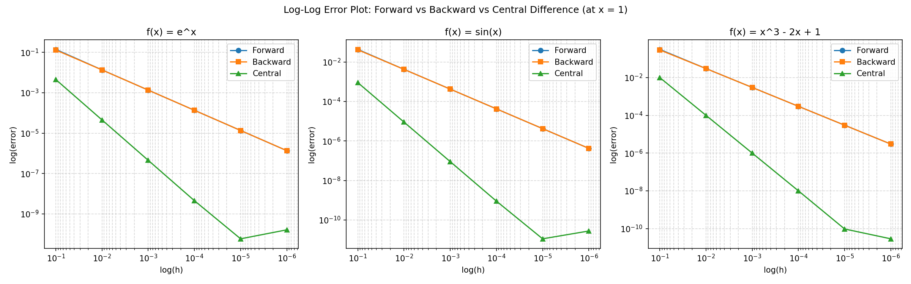

# Numerical Computing II — Assignment II
### Which Numerical Differentiation Method Should We Trust?

## What's in this repo

```
numdiff_project/
├── include/
│   ├── functions.h        # MathFunction base class + 3 test functions
│   ├── differentiator.h    # forward/backward/central difference methods
│   └── exceptions.h        # custom InvalidStepSizeException
├── src/
│   ├── functions.cpp
│   ├── differentiator.cpp
│   └── main.cpp             # runs everything, prints table, writes csv
├── data/
│   └── results.csv          # generated by running the program
├── plots/
│   └── log_log_error_plot.png
├── plot_results.py          # makes the log-log plot from results.csv
└── run_output.txt           # console output from a sample run
```

## How to build and run

```bash
g++ -std=c++17 -Wall -o numdiff src/main.cpp src/functions.cpp src/differentiator.cpp
./numdiff
python3 plot_results.py
```

## Design notes (OOP + exception handling)

- `MathFunction` is an abstract base class with pure virtual `evaluate()`
  and `exactDerivative()`. Each test function (`ExponentialFunction`,
  `SineFunction`, `PolynomialFunction`) inherits from it. `main.cpp`
  just loops over a `vector<unique_ptr<MathFunction>>` without caring
  which specific function it's looking at — that's the point of using
  polymorphism here.
- `Differentiator` holds the 3 finite-difference formulas as static
  methods, since they don't need to keep any state.
- `InvalidStepSizeException` (derived from `std::exception`) is thrown
  by a private `validateStepSize()` helper whenever `h <= 0`. `main.cpp`
  wraps every call in a `try/catch` block, and there's a small demo at
  the end of `main()` that deliberately calls `centralDifference` with
  `h = 0` to prove the exception actually gets thrown and caught.

## Results table (f'(1), absolute error)

See `run_output.txt` for the full table across all 3 functions and all
6 step sizes, or `data/results.csv` for the raw numbers used in the plot.

## Log-log error plot



## Answers to the analysis questions

**Which method is consistently the most accurate?**
Central difference, by a wide margin, across all three functions and
all step sizes. In the log-log plot its line sits below forward and
backward at every value of h, often by 2+ orders of magnitude.

**Does the observed error decrease at the expected rate?**
Yes. Forward and backward difference are first-order methods, so their
error should scale like O(h) — every time h shrinks by a factor of 10,
the error should also shrink by roughly a factor of 10. That's exactly
what the table/plot shows (their lines have slope ≈ 1 on the log-log
plot). Central difference is second-order, O(h²), so shrinking h by
10x should shrink the error by ~100x — again, that matches what we see
(slope ≈ 2), right up until floating point error takes over.

**Is there a value of h beyond which the error stops decreasing?**
Yes. For central difference the error keeps dropping until about
h = 1e-5, and then it flattens out or even ticks back up slightly at
h = 1e-6. This is floating-point round-off error: once h gets small
enough, `f(x+h) - f(x-h)` involves subtracting two nearly-identical
double-precision numbers, so we start losing significant digits
(catastrophic cancellation) faster than the truncation error is
shrinking. Forward/backward difference show the same effect too, just
at a smaller h because their errors start out larger to begin with.

---

## Bonus: symbolic derivation of the 3 formulas for f(x) = x³ − 2x + 1

Taylor-expanding f(x+h) and f(x−h) around x (exact for a cubic — the
series terminates, no higher-order remainder needed):

```
f(x+h) = x³ - 2x + 1 + (3x² - 2)h + 3x·h² + h³
f(x-h) = x³ - 2x + 1 + (3x² - 2)h·(-1) ... 
       = x³ - 2x + 1 - (3x² - 2)h + 3x·h² - h³
```

(full sympy-expanded forms are in `derivation.txt`)

**Forward difference:**
```
f'(x) ≈ [f(x+h) - f(x)] / h  =  3x² - 2 + 3xh + h²
```
Since the exact derivative is `f'(x) = 3x² - 2`, the **error term** is:
```
Error = f'(x) - forward = -h(3x + h) = O(h)
```

**Backward difference:**
```
f'(x) ≈ [f(x) - f(x-h)] / h  =  3x² - 2 - 3xh + h²
```
```
Error = f'(x) - backward = h(3x - h) = O(h)
```

**Central difference:**
```
f'(x) ≈ [f(x+h) - f(x-h)] / (2h)  =  3x² - 2 + h²
```
```
Error = f'(x) - central = -h² = O(h²)
```

This matches the numerical results perfectly: for this cubic, the
central-difference error is *exactly* `-h²`, independent of x — you
can check this against the table (e.g. at h = 0.1, error = 0.01 = h²
exactly, before floating point noise takes over at very small h).
